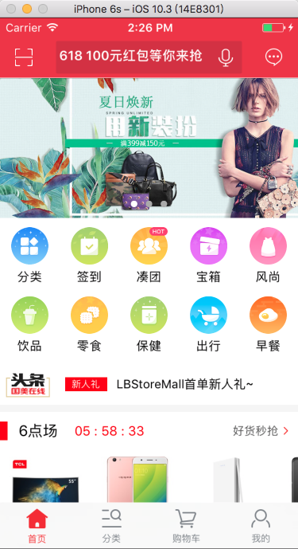
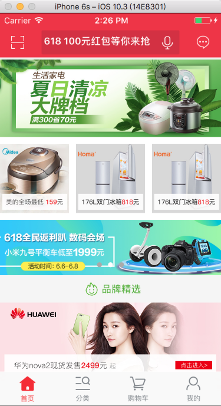
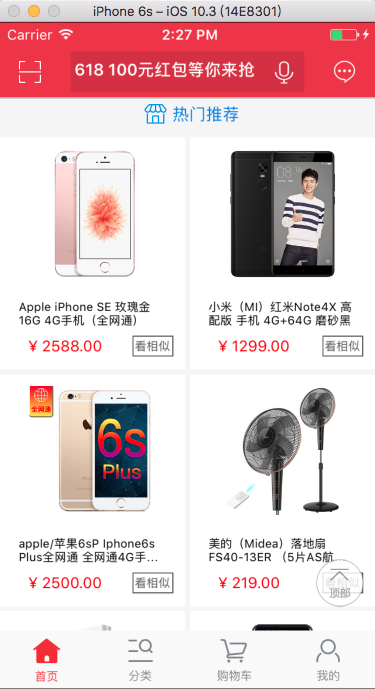

# LBStoreMall
## 电商类项目
1. 初始化项目，更改系统标签栏，增加标签按钮点击动画

2. 导航栏实现

3. 扫描控制器的跳转和实现

4. 首页的实现步骤：

用滑动视图UICollectionView来实现，页面布局分为4组，每组根据需要设置组头视图和组尾试图，对于复杂布局在cell内部再使用UICollectionView来进行实现，分组实现各组的布局和数组获取。

* 首页截图

